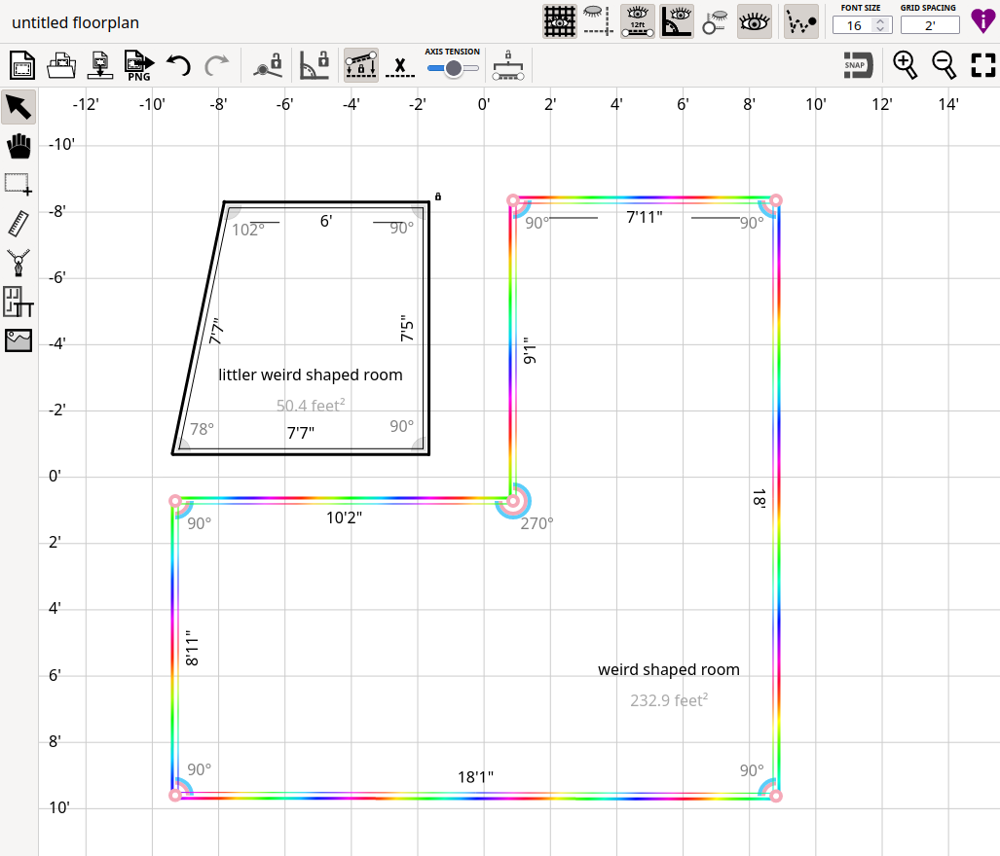

# drawall
This is a CAD tool for making quick and easy mockups of floor plans.

It's designed to support fuzzy constraints given imprecise measurements—because we've all had the experience of taking a thousand measurements, then trying to draw it up and finding that the inches don't *quite* add up! Or trying to plan a move based off of vague dimensions provided by a landlord.

## constraints
To support imprecise and possibly conflicting measurements, constraints are "soft," and are applied with kinematic spring forces. Currently supported are constraints on the angle of a corner, the length of a wall or ruler, and alignment to the X/Y axes. The strength of constraints can be controlled with tension sliders.

Individual wall corners can also be locked in place (this is a hard constraint).

## feature todo list
- [x] save/load json to localstorage
- [ ] save/load json to disk
- [x] export to PNG
- [ ] export to 3D obj
- [ ] simple furniture drawing and arranging
- [ ] doors & windows
- [ ] 3D view
- [ ] background reference images

## development setup
Simple and absurd, because I've thus far avoided doing things properly (eg using webpack) for _reasons_ (I spent too long professionally maintaining build systems, and now it doesn't give me any dopamine). Requires python3 and tsc on the path.

I like to run `test-server.py` to spin up a basic a web server served at http://localhost:8234, which calls `build.sh` automatically whenever the page is refreshed, and returns a plaintext page of compiler errors (if there are any). Yeah. It's silly.

Or you can just run `build.sh` yourself, serve the static files with your favorite teeny webserver (`python3 -m http.server` is my go-to, but ofc you could also use `caddy` or smth). It's just a static site, so there's no actual backend to spin up.

Note that for the files for which order matters, the order is determined by the list hardcoded in `build.sh`.

